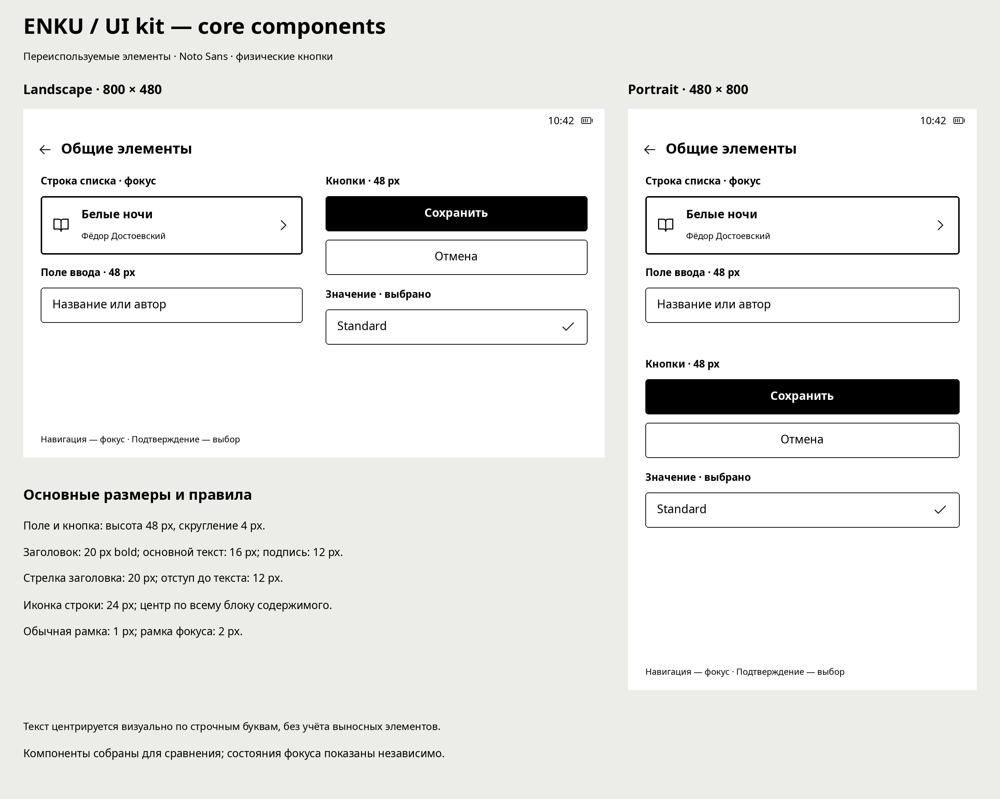

# ENKU

An open-source e-reader project for Waveshare ESP32-S3 ePaper 3.97″.

**Status: UI design and specification. Firmware is not implemented in this repository yet.**

ENKU is designed for physical buttons, with landscape (800×480) and portrait (480×800) layouts, Russian and English UI, and Noto Sans reading typography.

## Planned features

- Library with grid/list views, search, filters and sorting.
- Reading progress, bookmarks, table of contents and in-book search.
- Five reading presets: Spacious, Comfortable, Standard, Compact, Dense; manual Custom settings and optional per-book settings.
- Manual orientation selection, sleep from the quick menu, static sleep cover.
- Saved Wi-Fi credentials and a separate list of trusted networks.
- Import from memory card and local Wi-Fi; USB transport remains undecided.

These describe intended behavior, not working firmware features.

## Design material

- [Screen inventory](docs/screens.md): latest available boards and translation status.
- [Navigation specification](docs/navigation.md).
- [Roadmap](ROADMAP.md).
- [UI rules](docs/ui-spec.md).
- Exploded logical layer diagrams: [Russian](design/renders/ui-layers-ru.svg), [English](design/renders/ui-layers-en.svg).

## Repository layout

`design/screens/ru` — Russian boards. `design/screens/en` — English samples and future localized boards. `design/renders` — editable SVG diagrams. `docs` — specification. Firmware and hardware directories will be added with actual source material.

## Contributing

See [CONTRIBUTING.md](CONTRIBUTING.md). Start with an issue, reference a screen ID, and include both orientations for layout changes.

## Licensing

This initial package has no final license grant yet. Code and design licensing must be selected before the first public release. Third-party icons/fonts require separate attribution and license verification. No third-party asset bundles are redistributed here. See [NOTICE.md](NOTICE.md).
