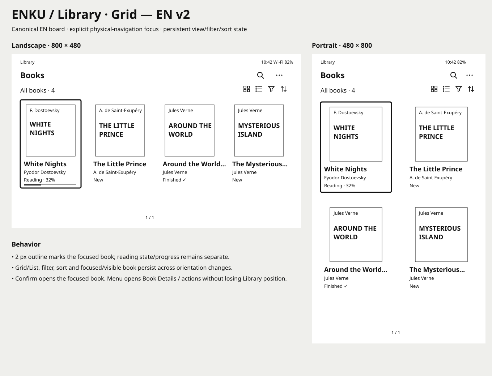
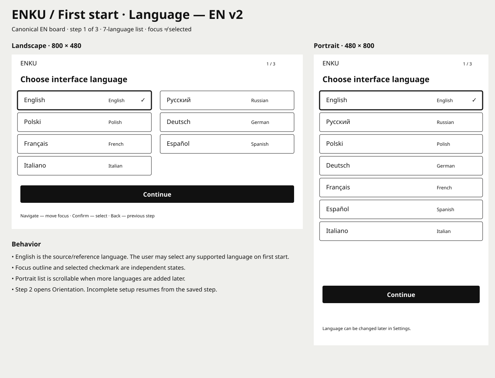
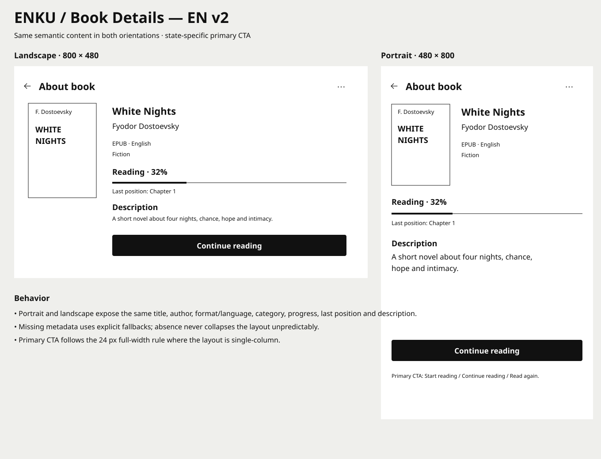
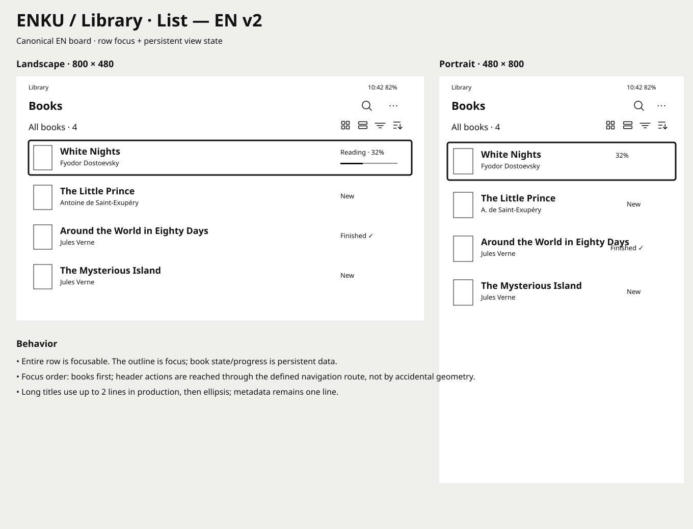

<p align="center">
  
</p>

<h1 align="center">ENKU</h1>

<p align="center">
  <strong>Open-source compact e-reader built around a 3.97″ e-paper display and ESP32-S3.</strong>
</p>

<p align="center">
  A focused, low-power reading device with physical controls, a carefully designed interface, local file management and an open hardware/software roadmap.
</p>

<p align="center">
  <strong>Project website:</strong> <a href="https://enkureader.com">enkureader.com</a>
</p>

<p align="center">
  <strong>UI languages:</strong> EN · PL · DE · FR · ES · IT · RU
</p>

---

## What is ENKU?

ENKU is an open-source e-reader project designed around the **Waveshare ESP32-S3-ePaper-3.97** platform with an **800 × 480** e-paper display.

The goal is not to reproduce a full tablet or build a feature-heavy general-purpose device. ENKU is intended to be a **small, calm and purpose-built reader**: fast enough for books, simple to operate, comfortable to use offline, and understandable from both the software and hardware side.

The project is being developed as a complete product system rather than only a firmware demo. It includes:

- firmware and device architecture;
- a complete non-touch UI for physical controls;
- library and reading workflows;
- typography and per-book settings;
- Wi-Fi and local browser-based file management;
- storage and import flows;
- sleep and power-management behavior;
- enclosure development and mechanical iterations;
- reproducible documentation for the hardware, firmware and enclosure.

> **Current status:** design system, UX specification and project architecture are actively being developed. Firmware bring-up begins after the target hardware is in hand. Features listed below are planned unless explicitly marked as completed.

### Looking for hardware partners and component suppliers

ENKU is currently looking for **hardware partners, distributors and component suppliers** interested in supporting the development of the project.

The most useful forms of support at this stage are:

- Waveshare ESP32-S3-ePaper-3.97 development units;
- Li-Po batteries suitable for a compact e-reader enclosure;
- buttons, switches, fasteners and other enclosure hardware;
- prototype and replacement components for hardware testing;
- project discounts or sample units;
- technical information about supplied components;
- support for future hardware revisions and enclosure prototypes.

Partners can be credited in the project documentation and repository as hardware partners or component suppliers where appropriate.

The goal is to build ENKU around readily available, reproducible parts rather than one-off or inaccessible hardware.

For partnership or supply discussions, please open an issue or contact the project owner through GitHub.

## Support ENKU

ENKU is developed in the open. You can help the project without spending money:

- **Star the repository** to make the project easier to discover.
- **Test and report issues** when firmware and hardware builds are available.
- **Contribute** code, documentation, translations, UI feedback, hardware notes or enclosure work — see [CONTRIBUTING.md](CONTRIBUTING.md).
- **Share ENKU** with people interested in open hardware, e-paper and compact readers.

GitHub Sponsors is being prepared as the project's primary funding channel. Funding, when enabled, will be used for development hardware, prototype boards, batteries, enclosure iterations and other direct project costs.

Project contact and support page: **https://enkureader.com/contact**

## Project goals

ENKU is being designed around a deliberately narrow set of product goals:

- provide a **comfortable, distraction-free reading experience** on a compact e-paper device;
- remain useful **fully offline**;
- use **physical controls** instead of depending on a touchscreen;
- keep book storage, reading progress and settings under the user's control;
- support a clean local workflow for importing and managing books;
- make the firmware, hardware assumptions and enclosure work understandable and reproducible;
- stay small enough to be a practical everyday reader rather than a general-purpose tablet.

## Non-goals

ENKU is **not** intended to become:

- an Android-like general-purpose device;
- a multimedia tablet;
- a cloud-dependent reading service;
- a storefront or DRM ecosystem;
- a notification-heavy connected gadget;
- a platform that hides core reading features behind an account.

The project favors a smaller, coherent feature set over adding functionality that does not improve reading.

## Why ENKU?

### Reading first

The interface is built around one job: **reading**. The reader screen stays visually quiet, controls appear only when needed, and common actions are reachable without navigating through deep menus.

### E-paper from the beginning

ENKU is designed specifically for e-paper constraints rather than adapting a conventional LCD interface afterward. Refresh behavior, focus states, progress updates, sleep screens and interaction density are all treated as part of the product architecture.

### Physical controls, no touchscreen dependency

The UI is designed for buttons and deterministic focus navigation. Focus, selected values and active states are separate concepts, which keeps the interface predictable and accessible without touch.

### Offline by default

Books remain usable without Wi-Fi. Connectivity is an optional management layer, not a requirement for reading.

### Open and understandable

The project aims to document not only the final code, but also **why** design and implementation decisions were made. UI rules, navigation behavior, hardware assumptions, power decisions and enclosure revisions are tracked openly.

### Compact hardware target

A 3.97″ panel keeps the device small enough to carry easily while still providing a practical 800 × 480 reading canvas. Both portrait and landscape orientations are part of the design system.

## Design preview

The interface is being designed in English first and then localized. The boards below are current **EN design previews** from the active UI revision work; they are not yet firmware screenshots.

<table>
<tr>
<td width="50%"></td>
<td width="50%"></td>
</tr>
<tr>
<td align="center"><strong>Library</strong></td>
<td align="center"><strong>First start / Language</strong></td>
</tr>
<tr>
<td width="50%"></td>
<td width="50%"></td>
</tr>
<tr>
<td align="center"><strong>Book details</strong></td>
<td align="center"><strong>Library / List</strong></td>
</tr>
</table>

The production visual source of truth remains the Figma design system and approved review boards.

---

## Target hardware

The current reference platform is:

| Component | Target |
| --- | --- |
| Main board | Waveshare ESP32-S3-ePaper-3.97 |
| MCU | ESP32-S3 |
| Display | 3.97″ e-paper, 800 × 480 |
| Input | Up / Function / Down control + BOOT; PWR handled separately |
| Storage | microSD / local storage workflow |
| Connectivity | Wi-Fi, BLE available at platform level |
| Power | Li-Po battery; final pack and runtime profile to be validated on hardware |
| Enclosure | Custom 3D-printable case, developed after mechanical verification |

The current official Waveshare source maps the active-low navigation inputs to GPIO4 (Up), GPIO5 (Function), GPIO6 (Down) and GPIO0 (BOOT). ENKU keeps raw GPIO details inside the platform layer and maps them to stable logical actions. PWR is treated separately through the PMU. Physical behavior will still be verified on the received board.

### Parts status

| Part | Current status |
| --- | --- |
| Waveshare ESP32-S3-ePaper-3.97 | **Selected / ordered** |
| 3.97″ 800 × 480 e-paper panel | **Part of reference platform** |
| microSD storage | **Platform feature — hardware verification pending** |
| Li-Po battery | **TBD — ~2000 mAh target, final size/connector pending** |
| Physical controls | **Platform controls to be mapped and tested** |
| Power switch / enclosure hardware | **TBD** |
| Fasteners | **TBD after mechanical measurements** |
| 3D-printed enclosure | **Planned after hardware measurement** |

See the detailed [Hardware baseline](docs/hardware.md) and [BOM status](docs/bom.md).

## Planned reader experience

### Library

- grid and list views;
- persistent sort and filter state;
- All / New / Reading / Finished filters;
- Title / Author / Recently opened / Recently added sorting;
- global title/author search independent from the active browse filter;
- bounded/paged result queries for large libraries;
- book details and cover handling;
- reading-state indicators;
- progress persistence;
- empty/error states designed as first-class screens.

### Reading

**Reader v1 formats:** EPUB, FB2 and TXT. PDF is deferred to a later revision.

- distraction-free reading view;
- portrait and landscape;
- semantic position preservation after layout changes;
- table of contents;
- bookmarks;
- in-book search;
- finished-book state;
- restore to the previous reading position.

### Typography

Five built-in presets are planned:

**Spacious · Comfortable · Standard · Compact · Dense**

Each preset controls font size, line spacing and margins. Manual adjustment switches the book to **Custom**. Settings can be global or overridden per book.

The current reading typeface target is **Noto Sans**.

### Local file management

The first management workflow is intentionally local:

- upload one or many books from a browser on the same network;
- drag-and-drop transfer;
- view storage usage and free space;
- inspect and correct metadata;
- replace or remove covers;
- safely delete or replace book files;
- show import progress and errors;
- reset progress or per-book settings.

Reading itself does not depend on this web interface.

### Wi-Fi

Planned Wi-Fi behavior includes:

- saved networks;
- explicit trusted/preferred networks;
- deterministic reconnect behavior;
- password entry using the shared on-device keyboard;
- session-scoped local web management;
- no cloud account requirement.

### Sleep and power

ENKU separates **panel sleep**, **device suspend** and **full PMU power-off**.

- user-facing Sleep means a measured system-level low-power state, not only `EPD_Sleep()`;
- static sleep screens suitable for e-paper;
- optional book-cover sleep screen;
- Wi-Fi off during Sleep;
- no live clock or animation while sleeping;
- auto-sleep suspended during writes/imports;
- full Power Off uses the board PMU shutdown path;
- exact suspend mechanism, wake sources and battery thresholds are validated on real hardware.

---

## Current limitations

ENKU is still in the pre-firmware stage, so several important decisions remain intentionally open:

- there is no production reader firmware yet, but the first framework-neutral TXT parser, forward-pagination, Reader Engine and ReaderSession MVPs are now implemented and host-testable;
- a framework-neutral C++ firmware scaffold now exists under `firmware/`;
- the firmware architecture, Library/storage model, parser abstraction, pagination model and runtime state machine are specified, while hardware integration and reader implementation remain pending;
- Reader v1 is scoped to EPUB, FB2 and TXT; PDF support is deferred and not yet designed;
- the exact CBOR codec library, localization table generator, diagnostics backend and parser/rendering stack are not selected;
- the final system suspend mechanism and wake-source mapping have not yet been measured on the real board;
- partial/region refresh behavior and ghosting thresholds have not yet been measured on the real panel;
- battery model and real-world runtime are not finalized;
- physical button mapping and wake behavior still require hardware testing;
- the enclosure has not been dimensioned from the production board yet;
- current EN design boards are design previews, not screenshots from running firmware.

These are active development items, not hidden assumptions.

## Firmware direction

Firmware has not yet been published as a working reader. The planned implementation is split into clear subsystems so the project can evolve without coupling the UI directly to storage or parser internals.

### Core layers

1. **Hardware abstraction**
   - display driver and refresh policy;
   - buttons and input events;
   - storage;
   - Wi-Fi;
   - battery/power state.

2. **Application state / Library**
   - stable `book_id`-based Library records;
   - bounded Browse/Search query model;
   - library index;
   - current book;
   - reading position;
   - bookmarks;
   - settings;
   - network state.

3. **Reader engine**
   - shared normalized parser/document interfaces;
   - first TXT parser MVP implemented in C++;
   - first forward text-pagination MVP implemented in C++;
   - first concrete DocumentReaderEngine implemented over the paginator;
   - ReaderSession with deterministic visited-page Previous and previous/current/next working-set cache;
   - Reader runtime integration updates AppState/progress and emits PageTurn refresh requests;
   - Open → Reading, Back → Library checkpoint and Finished transitions are now modeled in runtime;
   - concrete TXT book-loader/document-provider owns BookDocument → ReaderEngine → ReaderSession lifetime;
   - EPUB and FB2 parser adapters still pending;
   - normalized metadata/document model;
   - on-demand pagination using a font/text measurement abstraction;
   - typography presets;
   - semantic position mapping;
   - search and table of contents.

4. **Runtime and startup**
   - staged boot with boot-loop detection;
   - Normal / First Start / Recovery boot modes;
   - deterministic book open / page navigation;
   - Reader Menu and Search context;
   - debounced progress persistence;
   - sleep/wake restoration;
   - recoverable error handling.

5. **UI system**
   - reusable status bar, headers, rows, buttons and dialogs;
   - focus navigation;
   - portrait/landscape layout;
   - localization through stable semantic string keys;
   - English fallback with generated compact locale tables;
   - render plans describing only visible changes.

6. **Refresh Manager**
   - Region / Full / Deferred / None update classes;
   - bounded serialized refresh queue;
   - dirty-region coalescing and stale-plan removal;
   - measured ghosting/full-refresh escalation;
   - panel-refresh diagnostics.

7. **Persistence layer**
   - versioned CBOR records;
   - separate Library / settings / per-book state;
   - A/B generation recovery;
   - debounced progress checkpoints;
   - schema migration and integrity validation.

8. **Diagnostics and recovery**
   - stable structured error codes;
   - localized user-facing error mapping;
   - bounded in-memory logs;
   - compact critical/reboot diagnostics;
   - boot-loop detection and Recovery/Safe Mode.

9. **Local management service**
   - upload/import;
   - metadata operations;
   - storage status;
   - safe replace/delete transactions.

A framework-neutral C++ interface scaffold now exists under [firmware/](firmware/). The exact framework, build system, display library and parser stack will be chosen after display bring-up, memory profiling and real-device tests.

---

## Enclosure development

The enclosure is a separate project track, not an afterthought.

The plan is to develop the case in stages:

1. **Mechanical verification**
   - measure the production board;
   - verify display stack height, connectors, controls and battery space;
   - establish safe internal clearances.

2. **Functional prototype**
   - simple printable shell;
   - reliable access to controls and charging;
   - battery retention;
   - serviceable assembly.

3. **Ergonomic iteration**
   - comfortable grip;
   - practical button placement;
   - reduced thickness where mechanically safe;
   - portrait and landscape handling.

4. **Production-ready open model**
   - printable case files;
   - screw/assembly specification;
   - tolerances and print notes;
   - alternative battery/case variants where useful.

No final mechanical dimensions will be published as authoritative until the actual hardware is measured.

---

## Project roadmap

**At a glance:**  
**Design system → Hardware bring-up → Reader MVP → Connectivity → Enclosure → Open release**

### Phase 1 — Product and UI foundation

- [x] Define ENKU product direction
- [x] Select Waveshare ESP32-S3-ePaper-3.97 as reference platform
- [x] Define non-touch interaction model
- [x] Build reusable UI foundations and component rules
- [x] Audit the initial screen set
- [x] Define EN as the canonical UI language
- [ ] Finish canonical EN review boards
- [ ] Complete storage/import and Wi-Fi screen revisions

### Phase 2 — Hardware bring-up

- [ ] Verify board revision and physical controls
- [ ] Bring up the e-paper panel
- [ ] Characterize full/partial refresh behavior and ghosting
- [ ] Verify microSD and persistent storage
- [ ] Measure Active / DisplayIdle / Suspended / PoweredOff current
- [ ] Validate wake/power-off behavior
- [ ] Confirm typography rendering and memory use

### Phase 3 — Reader MVP

- [x] Select Reader v1 formats: EPUB, FB2 and TXT; PDF deferred
- [ ] Implement staged boot coordinator and first-usable-screen checkpoint
- [ ] Implement Refresh Manager queue and render-plan pipeline
- [x] Connect PageNext/PagePrevious runtime events to ReaderSession/AppState
- [x] Implement Reader open/back/finished runtime transitions
- [ ] Connect the firmware scaffold to verified platform drivers
- [x] Add ReaderSession page history/cache and deterministic Previous
- [ ] Expand pagination beyond TXT paragraphs and add real font metrics
- [ ] Implement EPUB/FB2 parsers and complete text layout
- [ ] Implement LibraryService/index and grid/list navigation
- [ ] Implement CBOR persistence and reading-position checkpoints
- [ ] Implement typography presets and Custom mode
- [ ] Add bookmarks and table of contents
- [ ] Add in-book search
- [ ] Add sleep/restore flow

### Phase 4 — Import and connectivity

- [ ] microSD import
- [ ] validation and duplicate handling
- [ ] local Wi-Fi upload
- [ ] browser-based library management
- [ ] metadata and cover editing
- [ ] transactional replace/delete behavior
- [ ] interruption and recovery handling

### Phase 5 — Enclosure

- [ ] Measure final hardware
- [ ] Build first functional case prototype
- [ ] Test battery placement and assembly
- [ ] Refine ergonomics
- [ ] Publish printable enclosure files and assembly notes

### Phase 6 — Release quality

- [ ] Finalize canonical EN string catalog
- [ ] Add RU/PL/DE/FR/ES/IT UI translations
- [ ] Validate missing-key fallback and long translated strings
- [ ] Run portrait/landscape layout validation
- [ ] Test malformed books, missing storage and interrupted transfers
- [ ] Validate reboot and power-loss recovery
- [ ] Validate boot-loop detection, Recovery Mode and diagnostic export
- [ ] Publish reproducible build instructions
- [x] Define software/documentation/hardware licensing model
- [ ] Tag the first public reader release

A more detailed implementation roadmap lives in [ROADMAP.md](ROADMAP.md).

---

## UI and design system

The UI source of truth is being developed in Figma and documented in this repository.

Key rules:

- non-touch interaction;
- focus is not the same as selection;
- both **800 × 480 landscape** and **480 × 800 portrait** are supported;
- 24 px standard screen inset;
- 48 px baseline button/input height;
- safe default focus for destructive dialogs;
- English is the canonical source language;
- e-paper refresh limitations are treated as product constraints.

Useful documents:

- [Project status](docs/status.md)
- [Architecture](docs/architecture.md)
- [Firmware project structure](docs/firmware-structure.md)
- [Input & physical controls](docs/input-model.md)
- [Power, sleep & wake model](docs/power-model.md)
- [Reader runtime & state machine](docs/runtime-state-machine.md)
- [Pagination & rendering model](docs/pagination-model.md)
- [Pagination MVP](docs/pagination-mvp.md)
- [Reader Engine MVP](docs/reader-engine-mvp.md)
- [Reader Session MVP](docs/reader-session-mvp.md)
- [Reader Runtime Integration MVP](docs/reader-runtime-mvp.md)
- [Book Loader / Document Provider MVP](docs/book-loader-mvp.md)
- [Metadata & parser model](docs/parser-model.md)
- [Licensing model](LICENSES.md)
- [Library & storage model](docs/storage-model.md)
- [Library data model & service interface](docs/library-model.md)
- [Persistence backend](docs/persistence-model.md)
- [Localization architecture](docs/localization-model.md)
- [Errors, logging & diagnostics](docs/diagnostics-model.md)
- [Boot & startup architecture](docs/boot-model.md)
- [Refresh Manager & e-paper update policy](docs/refresh-model.md)
- [Hardware baseline](docs/hardware.md)
- [BOM status](docs/bom.md)
- [UI specification](docs/ui-spec.md)
- [UI audit](docs/ui-audit.md)
- [UI revision plan](docs/ui-revision-plan.md)
- [Screen inventory](docs/screens.md)
- [Navigation model](docs/navigation.md)

## Repository structure

```text
assets/
  branding/         ENKU identity assets

design/
  screens/          historical and current UI boards
  renders/          project diagrams and visual references

firmware/
  README.md                firmware scaffold status and entry point
  include/enku/            framework-neutral core/input/reader/service interfaces

docs/
  architecture.md          system architecture
  firmware-structure.md    source layout and module boundaries
  input-model.md            physical controls and logical input mapping
  power-model.md            panel sleep, system suspend and PMU power-off
  runtime-state-machine.md  reader runtime and recovery behavior
  pagination-model.md       text layout and pagination rules
  pagination-mvp.md         first TXT → BookDocument → page implementation
  reader-engine-mvp.md      first BookDocument → Reader PageResult bridge
  reader-session-mvp.md     deterministic Next/Previous session navigation
  reader-runtime-mvp.md     page events → AppState → refresh integration
  book-loader-mvp.md        Library/source → parser → ReaderSession lifecycle
  parser-model.md           metadata normalization and parser abstraction
  storage-model.md          Library identity, state and transactional storage
  library-model.md          book records, browse/search queries and LibraryService
  persistence-model.md      CBOR records, schema versioning and crash recovery
  localization-model.md     string keys, fallback, plurals and locale packaging
  diagnostics-model.md      structured errors, bounded logs and Recovery Mode
  boot-model.md             staged startup, restore and boot-loop handling
  refresh-model.md          render plans, refresh queue and ghosting policy
  hardware.md              verified/planned hardware baseline
  bom.md                   parts/BOM status and sourcing priorities
  status.md                current project status
  UI and interaction specifications

locales/
  README.md          localization source-catalog rules

README.md           project overview
ROADMAP.md          implementation roadmap
NOTICE.md           third-party asset and release notes
```

The `firmware/` directory now contains the framework-neutral interface scaffold. Hardware-specific implementations and build files will be added after verified board bring-up. Hardware and enclosure source directories will be added when those workstreams contain verified material.

## Localization

**English is the canonical/source UI language.**

Planned first localization wave:

- English
- Russian
- Polish
- German
- French
- Spanish
- Italian

The interface language is independent from book content and keyboard input mode.

ENKU uses English as the canonical/fallback string set, stable semantic keys, named placeholders and a lightweight centralized plural system. Human-readable locale sources are intended to be converted into compact runtime lookup tables rather than parsed as JSON on the device.


## Open-source licensing

ENKU uses a scoped multi-license model:

- **Firmware/software:** Apache License 2.0
- **Project documentation:** Creative Commons Attribution 4.0 International (CC BY 4.0)
- **Future project-owned hardware/mechanical source:** CERN Open Hardware Licence Version 2 — Permissive (CERN-OHL-P-2.0)

The ENKU name/logo, historical design boards and third-party assets are not automatically covered by those blanket grants. Their scope and release requirements are documented in [LICENSES.md](LICENSES.md) and [NOTICE.md](NOTICE.md).

GitHub language detection is configured through `.gitattributes` so implementation source is represented by its actual code language instead of documentation/design assets dominating repository statistics.

---

<p align="center">
  <strong>ENKU is being built as a real reading device: small, focused, open and understandable.</strong>
</p>
