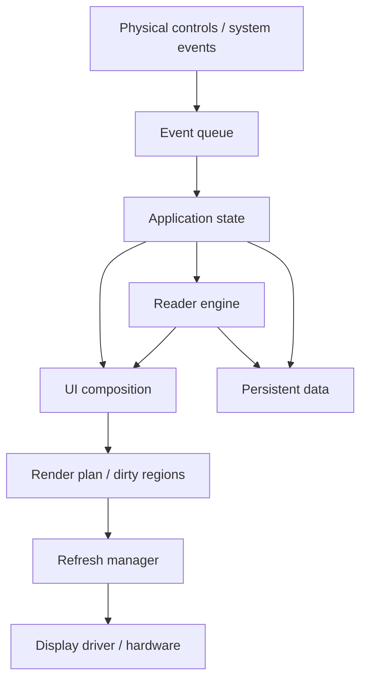

# ENKU Architecture

This document describes the intended high-level architecture of ENKU before the firmware implementation is locked down.

The goal is to keep the reader understandable, testable and modular: display/input/storage code should not leak into book parsing, and reader logic should not depend directly on the web-management layer.

## Architectural decisions

The following decisions are now part of the ENKU firmware baseline:

1. **Event-driven UI**  
   ENKU does not use a continuous frame/redraw loop. Button presses, navigation, page turns, setting changes, Wi-Fi events, import events and power events produce application events. Rendering happens only when visible state actually changes.

2. **Single application state model**  
   Logical product state is centralized rather than duplicated inside screens. This includes current screen, current book, semantic reading position, orientation, focus, Library view/filter/sort, global settings, per-book settings, Wi-Fi state and power state.

3. **Reader Engine is independent from UI**  
   The UI requests laid-out reading content from the Reader Engine. Parser/layout/pagination internals remain separate from screen code.

4. **Semantic reading position instead of page number**  
   Reading progress is anchored to book structure/text position rather than a rendered page index. Page numbers are unstable because typography, margins and orientation can change pagination.

5. **Dedicated Refresh Manager**  
   UI code describes what became dirty; a separate refresh layer decides whether to use a regional/partial update, a full update, combine updates, or defer them.

6. **No invisible redraws**  
   If application state changes but nothing visible on the current screen changes, the e-paper panel is not refreshed. For example, saving reading progress or a hidden Wi-Fi state change must not redraw the reading page.

## System overview



## 1. Event model

ENKU firmware should react to discrete events instead of continuously repainting UI state.

Examples:

- ButtonPressed
- ButtonReleased / ButtonHeld
- PageNext
- PagePrevious
- ScreenOpened
- SettingChanged
- OrientationChanged
- BookOpened
- BookPositionChanged
- ImportProgressChanged
- ImportCompleted
- WiFiConnected
- WiFiDisconnected
- BatteryStateChanged
- SleepRequested
- WakeRequested

Events update application state first. Rendering is a consequence of state changes, not the primary control flow.

This is important for e-paper because it reduces unnecessary refreshes, ghosting and power use.

## 2. Application state

A single logical state model should own product-level state such as:

- current screen / overlay;
- current book;
- semantic reading position;
- current focus target;
- orientation;
- UI language;
- Library view mode;
- Library filter and sort;
- focused/visible Library item;
- global reading settings;
- per-book reading overrides;
- bookmarks;
- saved/trusted networks;
- Wi-Fi state;
- battery/power state;
- active import/transfer state.

Screens should not own long-lived product state that must survive navigation, orientation change, sleep or reboot.

## 3. Reader engine

The Reader Engine is responsible for turning structured book content into renderable reading pages.

A conceptual request from the UI looks like:

```text
layoutPage(
    book,
    semanticPosition,
    typography,
    viewport
)
```

The engine returns:

- renderable page content;
- semantic position represented by the page;
- previous semantic position;
- next semantic position;
- reading-progress information;
- optional structural context such as chapter/section.

The UI does not need to know how EPUB, FB2 or TXT content is internally parsed.

The format adapter and metadata normalization rules are defined in [Metadata & Parser Model](parser-model.md).

The text layout, pagination and rendering rules are defined in [Pagination & Rendering Model](pagination-model.md).

Runtime transitions for opening, reading, search, sleep/wake and recovery are defined in [Reader Runtime & State Machine](runtime-state-machine.md).

The initial source/module layout and framework-neutral interfaces are defined in [Firmware Project Structure](firmware-structure.md).

The hardware-grounded button mapping and logical input actions are defined in [Input & Physical Controls](input-model.md).

The separation between display sleep, system suspend and PMU power-off is defined in [Power, Sleep & Wake Model](power-model.md).

The canonical string-key, fallback and pluralization strategy is defined in [Localization Architecture](localization-model.md).

### Reader v1 format scope

The first ENKU reader release targets three reflowable/text-oriented formats:

- **EPUB**
- **FB2**
- **TXT**

**PDF is explicitly deferred to a later revision.** It is not part of the Reader v1 scope because fixed-layout PDF rendering, zoom/pan navigation, rasterization and memory requirements would add substantial complexity and do not align well with the initial 3.97″ reading experience.

PDF support may be revisited after the core reflowable reader, storage model and rendering pipeline are stable.

## 4. Semantic reading position

ENKU must not use rendered page number as the authoritative reading position.

Rendered pages are unstable because changing any of the following can repaginate the book:

- font size;
- line spacing;
- margins;
- font metrics;
- portrait/landscape orientation;
- viewport size;
- parser/layout fixes.

The stored reading position should instead identify a stable logical point in the book.

The exact representation will be selected per format, but conceptually it should resemble:

```text
book_id
+ structural location (spine/chapter/section)
+ text/character offset or equivalent stable anchor
```

When layout changes, the Reader Engine repaginates around this anchor and restores the nearest valid logical position.

## 5. Render plan

UI composition produces a render plan rather than writing directly to the panel.

The render plan describes:

- what region changed;
- whether content is new or only state decoration changed;
- whether a full page changed;
- whether an overlay opened/closed;
- whether the update may safely wait;
- whether multiple dirty regions can be merged.

Examples:

- page turn → whole reading viewport dirty;
- focused row changed → old/new focus regions dirty;
- hidden Wi-Fi state changed → no visible dirty region;
- transfer progress changed → progress region dirty, throttled;
- orientation changed → full screen dirty.

## 6. Refresh Manager

The Refresh Manager owns e-paper update policy.

Responsibilities:

- choose full vs partial/region refresh;
- coalesce multiple UI updates;
- throttle rapidly changing states;
- force full refresh after measured ghosting thresholds;
- avoid refreshing invisible state;
- serialize display access;
- expose measured driver limitations to higher layers without leaking driver details into UI code.

The exact thresholds and partial-refresh rules are not fixed until the real Waveshare panel is characterized.

## 7. Hardware layer

Reference platform:

- Waveshare ESP32-S3-ePaper-3.97;
- 800 × 480 e-paper panel;
- physical controls;
- microSD/local storage;
- Wi-Fi;
- Li-Po power system.

Responsibilities:

- display initialization and refresh;
- button/input events;
- storage access;
- battery/power state;
- Wi-Fi transport;
- wake/sleep primitives.

Hardware behavior remains provisional until tested on the real board.

## 8. Hardware abstraction

The rest of the application should not need to know raw GPIO numbers or panel-driver details.

Planned interfaces include:

- display surface / refresh scheduler;
- logical input events;
- storage filesystem access;
- power-state service;
- network service;
- clock/time service where needed.

This layer is also where board-revision differences should be isolated.

## 9. Persistent data

Book files and reader state are logically separate.

The detailed Library/storage model is defined in [Library & Storage Model](storage-model.md).

The physical persistence strategy is defined in [Persistence Backend](persistence-model.md): versioned CBOR records with generation-based recovery, separated by write frequency.

Core decisions:

- maintain a persistent Library index;
- never use filename alone as book identity;
- assign a stable internal `book_id` backed by a content-derived fingerprint;
- keep raw book files separate from metadata, progress, bookmarks and per-book settings;
- store progress/bookmarks as semantic positions rather than rendered page numbers;
- cache normalized cover assets;
- use transactional import and replacement;
- keep incomplete imports outside the valid Library.

Safe import/replace operations must never turn a previously valid Library item into a broken one.

## 10. Local web management

The local browser interface is a management companion, not the main reader UI.

Initial scope:

- upload one or many books;
- drag-and-drop;
- storage/free-space status;
- metadata correction;
- cover management;
- safe delete/replace;
- import status and errors;
- mark read/unread;
- reset progress;
- clear per-book overrides.

It should remain local and session-scoped by default. Reading must not require a cloud account or an active connection.

## 11. E-paper refresh model

The exact driver strategy will be chosen after hardware characterization.

Expected rules:

- redraw only changed regions where reliable;
- avoid animation-like update loops;
- throttle progress/status updates;
- use periodic full refresh when real ghosting measurements justify it;
- expose user-facing refresh settings only if they have a clear product meaning.

## 12. Open decisions

The following are intentionally not frozen yet:

- exact firmware framework;
- concrete parser libraries/stack;

- partial refresh thresholds;
- battery model and percentage calibration;
- hard power-off implementation;
- final enclosure geometry.

These decisions will be resolved from measurement and prototyping rather than guessed in advance.
