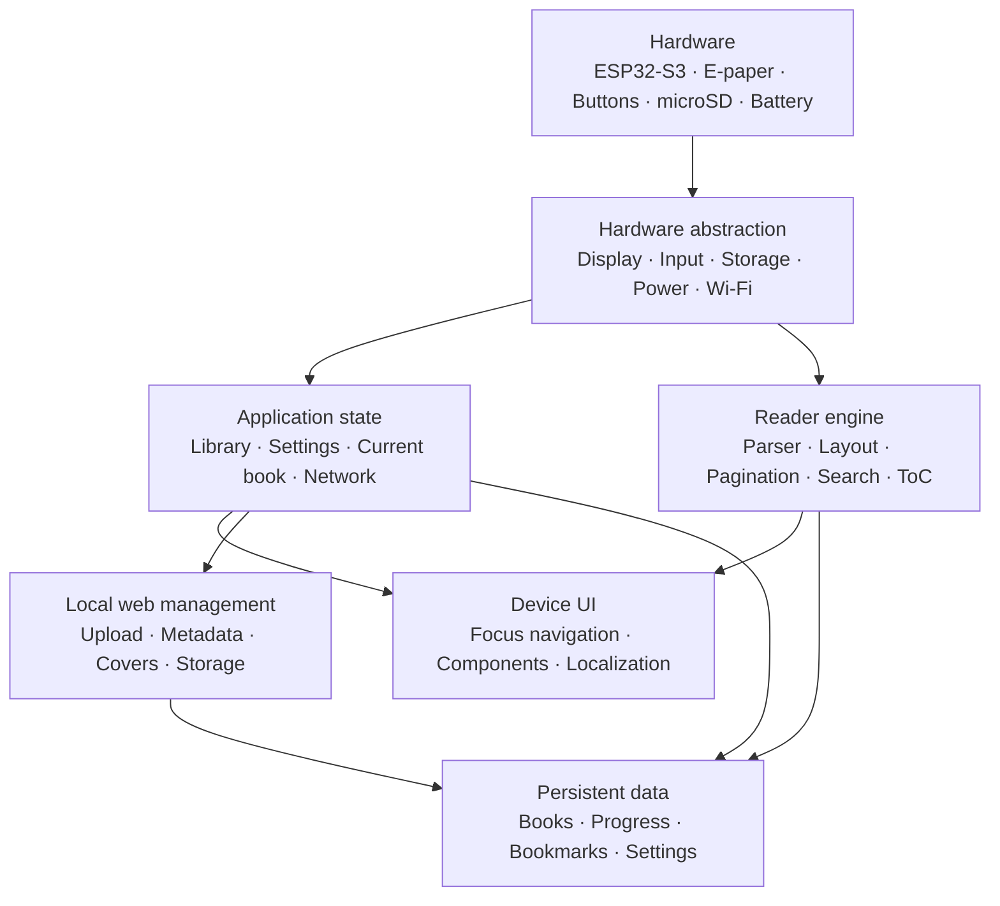

# ENKU Architecture

This document describes the intended high-level architecture of ENKU before the firmware implementation is locked down.

The goal is to keep the reader understandable, testable and modular: display/input/storage code should not leak into book parsing, and reader logic should not depend directly on the web-management layer.

## System overview

## 1. Hardware layer

Reference platform:

- Waveshare ESP32-S3-ePaper-3.97;
- 800 × 480 e-paper panel;
- physical controls;
- microSD/local storage;
- Wi-Fi;
- Li-Po power system.

Responsibilities:

- display initialization and refresh;
- button/input events;
- storage access;
- battery/power state;
- Wi-Fi transport;
- wake/sleep primitives.

Hardware behavior remains provisional until tested on the real board.

## 2. Hardware abstraction

The rest of the application should not need to know raw GPIO numbers or panel-driver details.

Planned interfaces include:

- display surface / refresh scheduler;
- logical input events;
- storage filesystem access;
- power-state service;
- network service;
- clock/time service where needed.

This layer is also where board-revision differences should be isolated.

## 3. Application state

Central state should own product-level information such as:

- Library index;
- focused/visible book;
- current book;
- semantic reading position;
- reading progress;
- bookmarks;
- global settings;
- per-book overrides;
- saved/trusted networks;
- orientation and UI language.

The UI reads and changes application state; it should not directly manipulate raw files.

## 4. Reader engine

The reader engine is responsible for turning book content into pages.

Planned responsibilities:

- format parsing;
- metadata and cover extraction;
- structured table of contents;
- text normalization;
- typography application;
- line breaking and pagination;
- semantic-position mapping;
- in-book search;
- search-match navigation.

A key design goal is to preserve the reader's logical position after typography or orientation changes.

## 5. Device UI

The UI is non-touch and controlled through physical input.

Core principles:

- deterministic focus navigation;
- focus ≠ selected ≠ active;
- reusable components;
- portrait and landscape from the same state model;
- English as the canonical UI language;
- e-paper-aware redraws;
- no animation assumptions.

The visual source of truth is the approved design system and review boards.

## 6. Persistent data

Book files and reader state are logically separate.

Examples:

- raw book file;
- normalized metadata;
- cover cache;
- semantic reading position;
- progress;
- bookmarks;
- global settings;
- per-book typography overrides.

Safe import/replace operations should be transactional so a failed write never turns a valid Library item into a broken one.

## 7. Local web management

The local browser interface is a management companion, not the main reader UI.

Initial scope:

- upload one or many books;
- drag-and-drop;
- storage/free-space status;
- metadata correction;
- cover management;
- safe delete/replace;
- import status and errors;
- mark read/unread;
- reset progress;
- clear per-book overrides.

It should remain local and session-scoped by default. Reading must not require a cloud account or an active connection.

## 8. E-paper refresh model

The exact driver strategy will be chosen after hardware characterization.

Expected rules:

- redraw only changed regions where reliable;
- avoid animation-like update loops;
- throttle progress/status updates;
- use periodic full refresh when real ghosting measurements justify it;
- expose user-facing refresh settings only if they have a clear product meaning.

## 9. Open decisions

The following are intentionally not frozen yet:

- exact firmware framework;
- initial book format set;
- parser library/stack;
- exact persistence backend;
- partial refresh policy;
- battery model and percentage calibration;
- hard power-off implementation;
- final enclosure geometry.

These decisions will be resolved from measurement and prototyping rather than guessed in advance.
