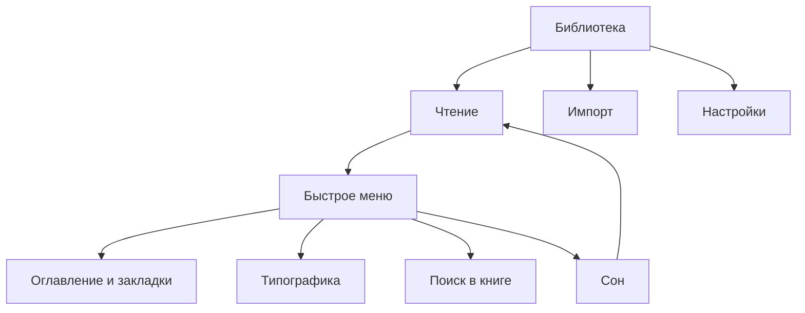

# ENKU — карта переходов v1

UI-спецификация для физического управления. Портрет 480×800 и альбом 800×480 используют одну логику. Назначение аппаратных кнопок уточняется отдельно.

## Переходы и возврат

| Исходный экран | Действие | Назначение | Возврат |
| --- | --- | --- | --- |
| Библиотека | Открыть книгу | Последняя сохранённая позиция | Библиотека: та же книга, фильтр, сортировка, список/сетка |
| Чтение | Открыть быстрое меню | Меню поверх книги | Та же позиция чтения |
| Быстрое меню | Оглавление / закладки | Окно с вкладками | Быстрое меню: исходный пункт |
| Оглавление / закладки | Выбрать главу или закладку | Чтение в выбранном месте | Окно закрывается |
| Быстрое меню | Добавить закладку | Сохранить текущую позицию | Чтение в том же месте |
| Быстрое меню | Aa | Пресеты с предварительным просмотром | Та же позиция текста после переразметки |
| Типографика | Ручное изменение | Пресет Custom | Значения применяются согласно подтверждению |
| Быстрое меню | Поиск | Ввод запроса → список результатов | Исходный пункт меню |
| Результаты поиска | Выбрать результат | Фрагмент с выделением и счётчиком | Список: прежний результат и запрос |
| Фрагмент поиска | Предыдущее / следующее | Соседнее совпадение | Список результатов |
| Быстрое меню | Сон | Статичный экран сна | Пробуждение: прежняя позиция чтения |
| Библиотека | Добавить книги | Выбор способа импорта | Библиотека с прежними параметрами |
| Импорт | Карта памяти | Файлы → выбор → проверка → результат | Предыдущий уровень файлов / способов |
| Импорт | Wi-Fi | Подключение → передача → проверка → результат | Экран способа импорта |
| Импорт | USB | Предварительный сценарий | Уточнить после выбора реализации USB |
| Настройки | Wi-Fi | Доступные / сохранённые сети | Настройки: Wi-Fi в фокусе |
| Сохранённые сети | Выбрать сеть | Данные сети и доверие | Та же сеть в списке |
| Настройки | Ориентация | Книжная / альбомная | Тот же экран и элемент фокуса |
| Настройки | Язык | Русский / English | Тот же экран на выбранном языке |
| Последняя страница | Переход вперёд | Окно «Книга прочитана» | Последняя страница |

## Общие правила

- Навигация перемещает фокус. Подтверждение выполняет действие или применяет значение.
- Фокус и выбранное значение различаются: рамка 2 px и галочка соответственно.
- После закрытия вложенного экрана восстанавливаются элемент фокуса и прокрутка родителя.
- Диалог получает фокус внутри себя. После отмены восстанавливается исходный элемент.
- При отмене удаления, замены или сброса прогресса данные не меняются.
- Позиция чтения хранится как позиция в тексте, чтобы смена ориентации и типографики не теряла место.
- Прогресс, закладки и индивидуальная типографика сохраняются; глобальные настройки используются по умолчанию.
- Сохранение Wi-Fi сети и доверие к ней — отдельные свойства. Допускается несколько доверенных сетей.
- Пустые состояния предлагают подходящее действие: импорт, сброс фильтра или поиск сети.
- Ошибка импорта ведёт к результату или повтору; неполный файл не становится доступной книгой.

## Открытые вопросы перед прошивкой

- Точное назначение физических кнопок, удержания и пробуждения.
- Реализация USB-передачи и поведение чтения во время подключения.
- Техническая реализация сохранения и восстановления позиции при замене изменённого текста книги.

Это карта поведения макетов, а не отчёт о реализованном функционале прошивки.
